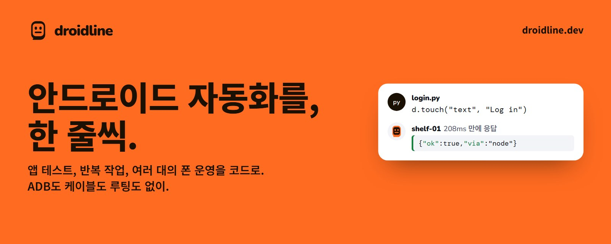
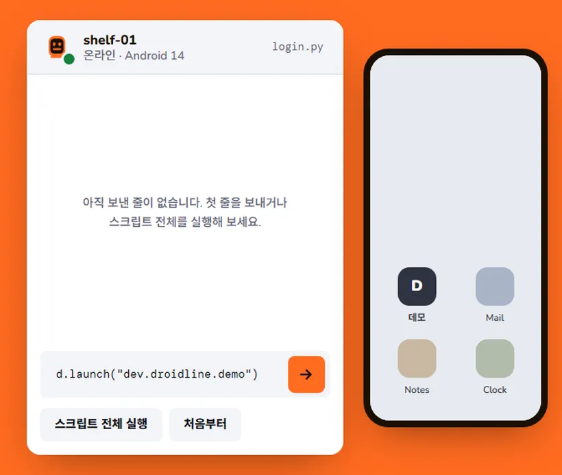

<p align="center">
  <a href="https://droidline.dev/ko/"></a>
</p>

<p align="center">
  <b>코드로 실제 안드로이드 폰을 자동화합니다.</b><br>
  앱 테스트, 반복 작업, 여러 대의 폰 운영, AI 에이전트에게 폰 맡기기까지.<br>
  Python, Node.js, 셸, HTTP 어디서든. ADB도, USB 케이블도, 루팅도 필요 없습니다.
</p>

<p align="center">
  <a href="https://droidline.dev/ko/"><b>웹사이트</b></a> ·
  <a href="https://droidline.dev/ko/docs/"><b>문서</b></a> ·
  <a href="https://github.com/KnifeLemon/Droidline/releases/latest"><b>내려받기</b></a> ·
  <a href="#빠른-시작">빠른 시작</a> ·
  <a href="#언어별로-쓰기">언어별 사용법</a> ·
  <a href="#문서">가이드</a>
</p>

<p align="center">
  <a href="https://github.com/KnifeLemon/Droidline/actions/workflows/ci.yml"></a>
  <a href="https://github.com/KnifeLemon/Droidline/releases/latest"></a>
  
  
  <a href="LICENSE"></a>
</p>

<p align="center"><a href="README.md">English</a> · <b>한국어</b> · <a href="README.zh-CN.md">简体中文</a></p>

<table>
  <tr>
    <td width="33%" valign="top"><b>ADB도 케이블도 없이</b><br>폰에 앱 하나를 설치하고 권한을 켠 뒤 QR 코드로 페어링하면 끝입니다. 개발자 옵션, USB 디버깅, 루팅 모두 필요 없습니다.</td>
    <td width="33%" valign="top"><b>어디서든 같은 명령</b><br><code>touch</code>는 Python, Node.js, CLI, HTTP, MCP 툴에서 모두 <code>touch</code>입니다. 전부 하나의 명세에서 만들어집니다.</td>
    <td width="33%" valign="top"><b>어디에 있는 폰이든</b><br>폰이 PC로 먼저 접속하므로 같은 Wi-Fi는 물론, 터널이나 직접 운영하는 릴레이를 거쳐 모바일 데이터에서도 동작합니다. 모든 줄은 종단간 암호화됩니다.</td>
  </tr>
</table>

## 활용 사례

* **내 앱 테스트**를 실제 폰에서 합니다. 문자 메시지로 받은 코드로 로그인하는 것처럼 다른 앱을 거치는 흐름도 포함됩니다.
* **선반 가득한 폰**이 매일 같은 루틴을 실행합니다. 폰마다 자기 네트워크나 프록시를 거칩니다.
* **AI 에이전트에게 손 달아 주기**: MCP를 통해 Claude, ChatGPT, Cursor 같은 에이전트가 폰 화면을 보고 조작할 수 있습니다.
* **작은 개인 자동화**도 됩니다. 밤에 Wi-Fi를 끄거나 한 시간마다 앱에서 값을 하나 가져오는 식입니다.

Droidline은 일반 앱이 받을 수 있는 권한만 쓰기 때문에 할 수 없는 일이 몇 가지 있습니다. [할 수 없는 것](#할-수-없는-것)을 참고하세요.

## 동작하는 모습

<p align="center">
  <a href="https://droidline.dev/ko/"></a><br>
  <sub>같은 데모를 브라우저에서 직접 실행하고, 가상 화면에서 요소를 골라 볼 수 있습니다: <a href="https://droidline.dev/ko/">droidline.dev</a></sub>
</p>

## 빠른 시작

PC(Windows, macOS, Linux)와 Android 9 이상의 안드로이드 폰이 필요합니다. 처음에는 둘을 같은 Wi-Fi에 두세요. [설치 가이드](https://droidline.dev/ko/docs/install/)가 단계마다 스크린샷과 함께 안내합니다.

1. **PC에서 서버 실행.** [릴리스](https://github.com/KnifeLemon/Droidline/releases/latest)에서 내 시스템용 `droidline` 압축 파일을 내려받아 `droidline`을 `PATH`에 두고 실행합니다. 켜 둔 채로 두세요.

   ```bash
   droidline serve
   ```

2. **폰에 앱 설치.** 같은 릴리스 페이지에서 `droidline-agent.apk`를 내려받아 엽니다. 앱의 **설정** 탭에서 접근성 서비스, Droidline 키보드, 알림, 배터리 최적화 제한 없음을 켭니다. Android 13 이상에서는 먼저 앱의 **제한된 설정 허용**이 필요하며, 앱이 위치를 알려 줍니다.

3. **페어링.** PC에서 아래 명령을 실행하고 앱의 **페어링** 탭에서 QR 코드를 스캔합니다.

   ```bash
   droidline pair
   ```

   카메라가 없다면 앱에서 **이 Wi-Fi에서 페어링**을 누르고, 앱에 뜬 6자리 코드를 입력하세요: `droidline pair 482913`.

4. **명령 보내기.**

   ```bash
   droidline launch com.android.settings
   droidline touch text "네트워크 및 인터넷"
   ```

폰이 없어도 됩니다. 모든 릴리스에 들어 있는 `droidline-fakephone`이 작은 데모 앱이 든 폰을 흉내 냅니다. [첫 스크립트 튜토리얼](https://droidline.dev/ko/docs/tutorial/)에서 이걸로 로그인 스크립트를 처음부터 끝까지 만들어 봅니다.

## 언어별로 쓰기

모든 인터페이스가 `localhost:8780`의 `droidline serve`와 통신하고, 명령 이름도 모두 같습니다.

**Python** (`pip install droidline`, Python 3.9 이상)

```python
from droidline import connect

d = connect()                                  # 이 PC와 페어링된 폰
d.launch("dev.droidline.demo")
if d.exists("text", "Close ad"):               # 조건 확인은 기다리지도 실패하지도 않음
    d.touch("text", "Close ad")
d.input("id", "email", "knife")                # 요소가 뜰 때까지 최대 10초 대기
d.touch("text", "Log in")
print(d.get_text("id", "greeting"))
```

**Node.js와 TypeScript** (`npm install droidline`, Node.js 18 이상)

```js
import { connect } from "droidline";

const d = await connect();
await d.launch("dev.droidline.demo");
await d.input("id", "email", "knife");
await d.touch("text", "Log in", { timeout: 15 });
console.log(await d.getText("id", "greeting"));
```

**C#과 .NET** (`dotnet add package Droidline`, .NET 8 이상 또는 .NET Framework 4.6.2 이상)

```csharp
using Droidline;

await using var d = await DroidlineClient.ConnectAsync();
await d.LaunchAsync("dev.droidline.demo");
await d.InputAsync("id", "email", "knife");
await d.TouchAsync("text", "Log in", timeout: 15);
Console.WriteLine(await d.GetTextAsync("id", "greeting"));
```

**명령줄** (서버에 포함)

```bash
droidline touch text "Log in"
droidline which text="Log in" id=main_tab --timeout 15
droidline screenshot shot.png
```

**HTTP** (어떤 언어, 어떤 도구에서든)

```bash
curl -s -X POST localhost:8780/devices/_/touch \
  -H 'content-type: application/json' -d '{"by":"text","value":"Log in"}'
```

**MCP로 AI 에이전트에서** (Claude, Cursor, VS Code 등)

```json
{ "mcpServers": { "droidline": { "command": "droidline", "args": ["mcp"] } } }
```

Claude Code에서는 `claude mcp add droidline -- droidline mcp`. Claude Desktop에서는 [Releases](https://github.com/KnifeLemon/Droidline/releases/latest)의 `droidline.mcpb`를 열어도 됩니다. 안에 `droidline`이 들어 있고, [MCP Registry](https://registry.modelcontextprotocol.io)에는 `io.github.KnifeLemon/droidline`으로 올라가 있습니다. 그 밖의 언어는 TCP 소켓을 열어 명령마다 JSON 한 줄을 보내면 됩니다. Go, Java, PHP 예제는 [다른 언어](https://droidline.dev/ko/docs/other-languages/)에 있습니다.

## 기능

- **좌표 대신 요소를 집습니다.** `dump()`는 화면을 트리로 돌려주며, 요소마다 `text`, `id`, `desc`가 있습니다. 명령에는 속성과 값을 넘깁니다: `touch("id", "login")`. 요소가 클릭을 거부하면 Droidline이 알아서 상위 요소나 bounds 중심을 탭합니다.
- **기다림이 내장되어 있습니다.** `touch`, `input`, `wait`는 요소가 뜰 때까지 기본 10초 기다립니다. `exists`, `checked`, `which` 같은 조건 확인은 바로 답하고, 요소가 없어도 예외를 던지지 않습니다.
- **알아보기 쉬운 에러.** 실패마다 코드, 한국어, 영어, 중국어 메시지, 재시도할 만한지 알려 주는 표시가 있습니다: `NOT_FOUND: 10초 동안 text 'Log in' 대상을 찾지 못했습니다. 현재 화면: com.example / .MainActivity`.
- **선반 가득한 폰.** PC 한 대가 여러 폰을 다룹니다. 한 폰에 보낸 명령은 순서대로, 다른 폰끼리는 동시에 실행되며, 폰마다 원하는 이름을 붙일 수 있습니다.
- **앱별 프록시.** 고른 앱만 로컬 VPN을 거쳐 socks5나 http 업스트림으로 보냅니다. 폰마다 업스트림 하나, 루팅 없이.
- **PC에서 받는 알림.** 하나를 기다리거나, 모두에 반응하거나, 답장, 열기, 지우기를 하거나, 서명된 웹훅으로 넘길 수 있습니다.
- **새 모바일 IP.** `cuts_network`를 준 `batch`는 폰이 오프라인인 동안에도 폰에서 계속 돌기 때문에, 비행기 모드 켜기, 대기, 끄기를 호출 하나로 할 수 있습니다. 설정 화면은 먼저 `intent`로 엽니다. 단계별 방법은 [레시피](https://droidline.dev/ko/docs/recipes/#설정-앱-강제-종료-데이터-삭제-네트워크-전환)에 있습니다.
- **두 번 실행되지 않습니다.** 모바일 데이터가 끊겼던 폰은 끊긴 지점부터 이어 가고, 보내던 명령은 다시 실행하지 않고 폰에 남아 있던 응답으로 답합니다.
- **잘 버티는 선택자.** 조건을 묶거나 옆의 요소로 가리킬 수 있습니다: `touch({"class": "android.widget.Switch", "row": {"text": "Wi-Fi"}})`. `find`는 누르고 그 안을 다시 찾을 수 있는 요소를 돌려주고, `wait_idle`은 화면이 더 바뀌지 않을 때까지 기다립니다.
- **켜기 전에는 꺼져 있는 선택 도구.** `droidline inspect`는 화면과 요소를 보여 주고, 선택자를 코드와 함께 추천하며, 폰을 쓰는 동안 스크립트를 녹화합니다. `droidline webdriver`로 Appium 클라이언트와 스크립트가 폰을 다룹니다. 그 밖에 pytest 플러그인, 스크립트끼리 폰을 나눠 쓰는 lease, 요소가 없는 화면을 위한 그림과 글자 찾기가 있습니다.
- **한국어, English, 简体中文**을 앱, 에러 메시지, 문서 모두에서 지원합니다.

## 스크린샷

<table>
  <tr>
    <td width="33%"></td>
    <td width="33%"></td>
    <td width="33%"></td>
  </tr>
  <tr>
    <td align="center"><sub>설정: 권한마다 해당 설정 화면으로 가는 버튼</sub></td>
    <td align="center"><sub>페어링: QR 코드 스캔 또는 6자리 코드</sub></td>
    <td align="center"><sub>상태: 연결, 경로, 권한</sub></td>
  </tr>
</table>

<sub>스크린샷은 영어로 설정한 폰에서 찍었습니다. 앱은 폰 언어에 맞춰 한국어로도 표시됩니다.</sub>

## 어디서든 폰에 닿기

폰이 항상 먼저 접속하므로 폰에는 열린 포트가 필요 없습니다. 내 네트워크에 맞는 경로를 고르세요. 폰은 경로를 순서대로 시도하고, 가능하면 Wi-Fi로 돌아옵니다.

| 경로 | 필요한 것 | 동작 방식 |
|---|---|---|
| 같은 Wi-Fi | 없음 | 폰이 UDP 브로드캐스트로 PC를 찾아 바로 접속합니다. |
| 포트포워딩 | 포트 하나 열기 | 폰이 공인 주소로 TLS 접속하고, PC 인증서로 상대를 확인합니다. |
| 터널 | cloudflared, ngrok 등 | PC가 터널을 열어 두고, 폰은 터널 주소로 들어옵니다. |
| 직접 운영하는 릴레이 | Cloudflare Workers 또는 VPS | PC와 폰이 둘 다 릴레이로 접속합니다. 릴레이는 읽을 수 없는 줄을 전달만 합니다. |

두 줄짜리 핸드셰이크 뒤의 모든 줄은 내 PC와 폰만 가진 키(P-256, AES-256-GCM)로 암호화되므로, 터널이나 릴레이는 암호문만 전달합니다. [원격 연결 가이드](https://droidline.dev/ko/docs/remote/)에서 경로마다 단계별로 설명합니다.

## 할 수 없는 것

Droidline은 일반 앱이 받을 수 있는 권한만 씁니다. 그래서 못 하는 일이 있고, 시작 전에 아는 편이 낫습니다.

- 다른 앱이 공개하지 않은 화면은 열 수 없습니다. `launch`는 대신 시작 화면을 엽니다.
- PIN, 패턴, 비밀번호 잠금 화면은 풀 수 없습니다.
- 앱 강제 종료, 데이터 삭제, 네트워크 전환을 한 번에 하는 명령은 없습니다. 설정 앱은 제조사, Android 버전, 언어마다 달라서 [레시피](https://droidline.dev/ko/docs/recipes/#설정-앱-강제-종료-데이터-삭제-네트워크-전환)가 설정 화면의 버튼을 누르며, 내 폰에 맞게 버튼 이름을 고쳐야 할 수 있습니다. 선택 기능인 기기 소유자 모드에서는 `clear_data`가 앱 데이터를 바로 지웁니다.
- 게임이나 일부 직접 그리는 앱은 요소를 내보이지 않습니다. 이런 곳은 `tap` 좌표와 `color(x, y)`를 씁니다.
- Android 15 이상은 알림 속 인증번호를 앱에서 가립니다. 도착 여부는 알 수 있고, 번호는 앱 화면에서 읽습니다.

[전체 목록](https://droidline.dev/ko/docs/limitations/)에서 하나씩 설명합니다.

## 문서

| 하고 싶은 것 | 시작할 곳 |
|---|---|
| 처음부터 차근차근 설치 | [설치](https://droidline.dev/ko/docs/install/) |
| 폰 없이 첫 스크립트 작성 | [첫 스크립트 만들기](https://droidline.dev/ko/docs/tutorial/) |
| 내 언어로 쓰기 | [Python](https://droidline.dev/ko/docs/python/) · [Node.js](https://droidline.dev/ko/docs/nodejs/) · [CLI](https://droidline.dev/ko/docs/cli/) · [HTTP](https://droidline.dev/ko/docs/http/) · [AI 에이전트](https://droidline.dev/ko/docs/ai-agents/) |
| 화면에서 알맞은 요소 찾기 | [요소 찾기](https://droidline.dev/ko/docs/finding-elements/) |
| 요소를 눌러 보며 찾거나, 스크립트 녹화하기 | [화면 검사와 녹화](https://droidline.dev/ko/docs/inspector/) |
| Appium 스크립트 실행하기 | [Appium과 WebDriver](https://droidline.dev/ko/docs/appium/) |
| pytest나 Node.js로 테스트하기 | [테스트 프레임워크](https://droidline.dev/ko/docs/testing/) |
| 검증된 패턴 가져다 쓰기 | [레시피](https://droidline.dev/ko/docs/recipes/) |
| 명령 찾아보기 | [명령어 레퍼런스](https://droidline.dev/ko/docs/commands/) |
| 모바일 데이터의 폰에 연결 | [원격 연결](https://droidline.dev/ko/docs/remote/) |
| 안 될 때 해결하기 | [문제 해결](https://droidline.dev/ko/docs/troubleshooting/) |
| 통신 규격 이해하기 | [`spec/PROTOCOL.md`](spec/PROTOCOL.md) |

## 소스에서 빌드

필요한 것: Go 1.26 이상, Node.js 22, Python 3.9 이상. 앱을 빌드하려면 JDK 17 이상과 Android SDK가 필요합니다(Android Studio에 들어 있는 JDK로 충분합니다).

```bash
git clone https://github.com/KnifeLemon/Droidline.git
cd Droidline
go build ./server/cmd/...              # droidline, droidline-relay, droidline-fakephone
go test ./spec/ ./server/...
node scripts/gen.mjs --check           # SDK 메서드가 spec/commands.json과 맞는지
cd sdk/python && python -m pytest
cd sdk/node && npm ci && npm test
dotnet test sdk/dotnet
cd agent && ./gradlew assembleDebug testDebugUnitTest
```

`scripts/integration.sh`는 서버, 가상 폰, 두 SDK 데모를 함께 돌리며, CI가 하는 일과 같습니다.

| 경로 | 내용 |
|---|---|
| [`spec/`](spec) | `commands.json`(모든 명령, 3개 언어), `PROTOCOL.md`, 암호화 테스트 벡터 |
| [`server/`](server) | Go: `droidline`(서버, CLI, MCP), `droidline-relay`, `droidline-fakephone` |
| [`agent/`](agent) | 안드로이드 앱(Kotlin) |
| [`sdk/python`](sdk/python), [`sdk/node`](sdk/node), [`sdk/dotnet`](sdk/dotnet) | 공식 SDK. 명세에서 생성한 메서드와 얇은 클라이언트 |
| [`relay/worker`](relay/worker) | Cloudflare Workers용 릴레이 |
| [`examples/`](examples) | 가상 폰에서 도는 데모 스크립트 |

## 기여하기

풀 리퀘스트를 환영합니다. 명세, 생성기, 테스트가 어떻게 맞물리는지는 [CONTRIBUTING.md](CONTRIBUTING.md)에 있습니다. 지금 가장 도움이 되는 기여는 실제 폰에서의 사용 후기입니다. 제조사와 Android 버전, 그리고 강제 종료, 데이터 삭제, 네트워크 전환을 위한 [설정 앱 레시피](https://droidline.dev/ko/docs/recipes/#설정-앱-강제-종료-데이터-삭제-네트워크-전환)가 그 폰의 버튼 이름으로 동작하는지 알려 주세요. Droidline이 탭을 몇 번이라도 줄여 줬다면, ⭐ 하나가 다른 사람들이 찾는 데 도움이 됩니다.

## 현황

버전 0.1입니다. 서버, CLI, MCP 어댑터, 릴레이, 두 SDK는 가상 폰을 상대로 테스트를 통과했고, 앱은 단위 테스트를 통과하고 Android 13 에뮬레이터에서 동작합니다. 다음 단계는 여러 제조사의 실제 폰에서의 검증입니다. 무엇을 어떻게 확인했는지는 [`docs/STATUS.md`](docs/STATUS.md)에 있습니다.

## 보안과 개인정보

누가 폰을 제어할 수 있는지는 페어링이 정하고, 핸드셰이크 이후의 모든 것은 종단간 암호화됩니다. 보안 문제는 [SECURITY.md](SECURITY.md)에 적힌 대로 비공개로 알려 주세요.

Droidline은 사용 데이터를 모으지 않고 원격 측정도 보내지 않습니다. 서버는 내 컴퓨터에서만 연결을 받고, 앱은 페어링한 PC, 그리고 새 버전 확인을 위해 하루 한 번 GitHub와만 통신합니다. 본인 소유이거나 자동화해도 되는 폰과 계정에만 쓰세요. 용도는 [이용 약관](https://droidline.dev/ko/terms/)에 있습니다.

## 라이선스

MIT. [LICENSE](LICENSE)를 보세요.

<p align="center">
  <a href="https://star-history.com/#KnifeLemon/Droidline&Date"></a>
</p>
