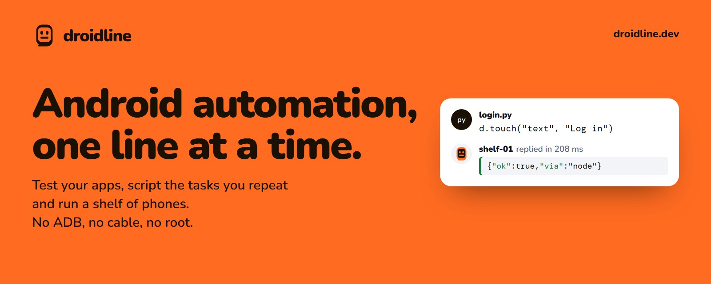
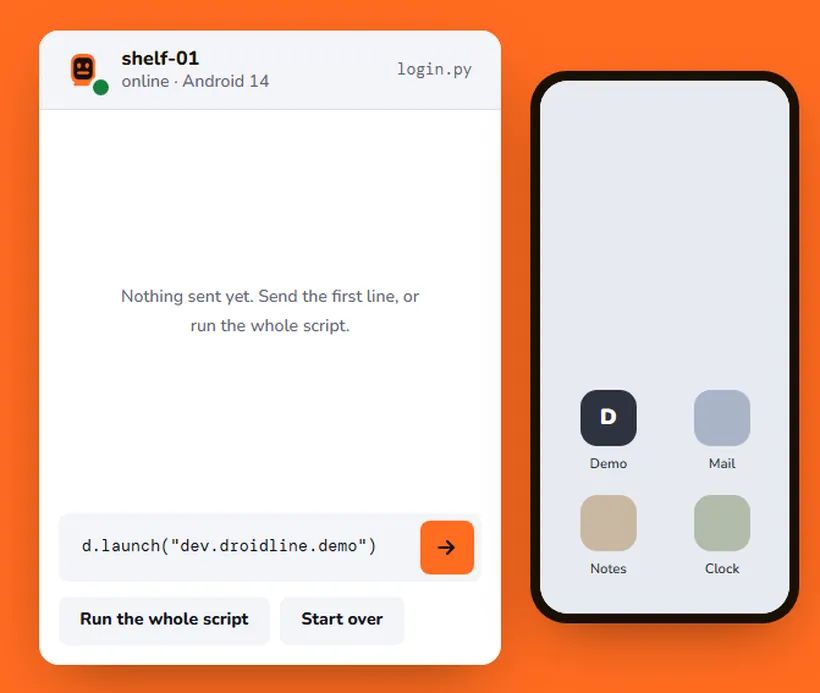

<p align="center">
  <a href="https://droidline.dev"></a>
</p>

<p align="center">
  <b>Automate real Android phones from your code.</b><br>
  Test your apps, script the tasks you repeat, run a shelf of phones, or let an AI agent use one.<br>
  Python, Node.js, the shell or HTTP. No ADB, no USB cable, no root.
</p>

<p align="center">
  <a href="https://droidline.dev"><b>Website</b></a> ·
  <a href="https://droidline.dev/docs/"><b>Docs</b></a> ·
  <a href="https://github.com/KnifeLemon/Droidline/releases/latest"><b>Download</b></a> ·
  <a href="#quick-start">Quick start</a> ·
  <a href="#use-it-from-your-language">Languages</a> ·
  <a href="#documentation">Guides</a>
</p>

<p align="center">
  <a href="https://github.com/KnifeLemon/Droidline/actions/workflows/ci.yml"></a>
  <a href="https://github.com/KnifeLemon/Droidline/releases/latest"></a>
  
  
  <a href="LICENSE"></a>
</p>

<p align="center"><b>English</b> · <a href="README.ko.md">한국어</a> · <a href="README.zh-CN.md">简体中文</a></p>

<table>
  <tr>
    <td width="33%" valign="top"><b>No ADB, no cable</b><br>Install one app on the phone, turn on its permissions and pair it with a QR code. No developer options, no USB debugging, no root.</td>
    <td width="33%" valign="top"><b>The same command everywhere</b><br><code>touch</code> is <code>touch</code> in Python, Node.js, the CLI, HTTP and as an MCP tool, all generated from one spec.</td>
    <td width="33%" valign="top"><b>Phones anywhere</b><br>The phone connects out to your PC, so it works on the same Wi-Fi or on mobile data through a tunnel or a relay you run. Every line is encrypted end to end.</td>
  </tr>
</table>

## What people use it for

* **Testing your own app** on real phones, including flows that cross into other apps, such as a login with a code from a text message.
* **A shelf of phones** running the same routine every day, each through its own network or proxy.
* **Giving an AI agent hands**: through MCP, Claude, ChatGPT, Cursor and other agents can look at a phone screen and act on it.
* **Small personal automations**, such as turning Wi-Fi off at night or collecting a value from an app every hour.

Droidline uses only permissions an ordinary app can get, so a few things are out of reach: see [What it cannot do](#what-it-cannot-do).

## See it in action

<p align="center">
  <a href="https://droidline.dev"></a><br>
  <sub>Try the same demo in your browser, and pick elements on a simulated screen, on <a href="https://droidline.dev">droidline.dev</a></sub>
</p>

## Quick start

You need a PC (Windows, macOS or Linux) and an Android phone with Android 9 or later, on the same Wi-Fi for a first try. The [installation guide](https://droidline.dev/docs/install/) walks through each step with screenshots.

1. **Run the server on your PC.** Download the `droidline` archive for your system from [Releases](https://github.com/KnifeLemon/Droidline/releases/latest), put `droidline` on your `PATH`, and start it. Leave it running.

   ```bash
   droidline serve
   ```

2. **Install the app on the phone.** Download `droidline-agent.apk` from the same release page and open it. On the app's **Setup** tab, turn on the accessibility service, the Droidline keyboard, notifications and unrestricted battery use. On Android 13 and later, allow **restricted settings** for the app first; the app shows where.

3. **Pair them.** Run this on the PC and scan the QR code with the app's **Pair** tab:

   ```bash
   droidline pair
   ```

   No camera? Tap **Pair on this Wi-Fi** in the app and type the 6-digit code it shows: `droidline pair 482913`.

4. **Send a command.**

   ```bash
   droidline launch com.android.settings
   droidline touch text "Network & internet"
   ```

No phone at hand? `droidline-fakephone`, included in every release, simulates one with a small demo app. The [first-script tutorial](https://droidline.dev/docs/tutorial/) builds a complete login script against it.

## Use it from your language

Every interface talks to `droidline serve` on `localhost:8780` and uses the same command names.

**Python** (`pip install droidline`, Python 3.9+)

```python
from droidline import connect

d = connect()                                  # the phone paired with this PC
d.launch("dev.droidline.demo")
if d.exists("text", "Close ad"):               # conditions never wait and never fail
    d.touch("text", "Close ad")
d.input("id", "email", "knife")                # waits up to 10 s for the element
d.touch("text", "Log in")
print(d.get_text("id", "greeting"))
```

**Node.js and TypeScript** (`npm install droidline`, Node.js 18+)

```js
import { connect } from "droidline";

const d = await connect();
await d.launch("dev.droidline.demo");
await d.input("id", "email", "knife");
await d.touch("text", "Log in", { timeout: 15 });
console.log(await d.getText("id", "greeting"));
```

**C# and .NET** (`dotnet add package Droidline`, .NET 8+ or .NET Framework 4.6.2+)

```csharp
using Droidline;

await using var d = await DroidlineClient.ConnectAsync();
await d.LaunchAsync("dev.droidline.demo");
await d.InputAsync("id", "email", "knife");
await d.TouchAsync("text", "Log in", timeout: 15);
Console.WriteLine(await d.GetTextAsync("id", "greeting"));
```

**Command line** (comes with the server)

```bash
droidline touch text "Log in"
droidline which text="Log in" id=main_tab --timeout 15
droidline screenshot shot.png
```

**HTTP** (any language, any tool)

```bash
curl -s -X POST localhost:8780/devices/_/touch \
  -H 'content-type: application/json' -d '{"by":"text","value":"Log in"}'
```

**AI agents over MCP** (Claude, Cursor, VS Code and others)

```json
{ "mcpServers": { "droidline": { "command": "droidline", "args": ["mcp"] } } }
```

With Claude Code: `claude mcp add droidline -- droidline mcp`. Other languages can open a TCP socket and send one JSON line per command; see [Other languages](https://droidline.dev/docs/other-languages/) for Go, Java and PHP.

## Features

- **Pick the element, not the pixel.** `dump()` returns the screen as a tree with `text`, `id` and `desc` for every element. Commands take the field and the value: `touch("id", "login")`. When an element refuses a click, Droidline taps its parent or the center of its bounds by itself.
- **Waiting is built in.** `touch`, `input` and `wait` wait for their element, 10 seconds by default. Conditions such as `exists`, `checked` and `which` answer at once and never throw for a missing element.
- **Clear errors.** Every failure has a code, a message in English, Korean or Chinese, and a flag that says whether retrying helps: `NOT_FOUND: Could not find text 'Log in' within 10s. Current screen: com.example / .MainActivity`.
- **A shelf of phones.** One PC drives many phones. Commands to one phone run in order, different phones run in parallel, and each phone has a name you choose.
- **Per-app proxy.** Send chosen apps through a socks5 or http upstream with a local VPN, one upstream per phone, without root.
- **Notifications on the PC.** Wait for one, react to every one, reply, open or dismiss it, or forward it to a signed webhook.
- **New mobile IPs.** A `batch` sent with `cuts_network` keeps running on the phone while it is offline, so airplane mode on, wait, off works as one call. `intent` opens the Settings page first; the [recipes](https://droidline.dev/docs/recipes/#settings-force-stop-clear-data-network-switches) show it step by step.
- **Nothing runs twice.** A phone that drops off mobile data resumes where it left off; a command that was in flight is answered from the phone's cache, not run again.
- **Selectors that hold up.** Combine conditions or name an element by its neighbors: `touch({"class": "android.widget.Switch", "row": {"text": "Wi-Fi"}})`. `find` hands back elements you can click and search inside, and `wait_idle` waits until the screen stops changing.
- **Optional tools, off until you start them.** `droidline inspect` shows the screen and its elements, suggests selectors with code, and records a script while you use the phone. `droidline webdriver` lets Appium clients and scripts drive your phones. There is also a pytest plugin, leases for sharing phones between scripts, and picture and text matching for screens without elements.
- **English, 한국어, 简体中文** in the app, the error messages and the docs.

## Screenshots

<table>
  <tr>
    <td width="33%"></td>
    <td width="33%"></td>
    <td width="33%"></td>
  </tr>
  <tr>
    <td align="center"><sub>Setup: each permission with a button to its settings screen</sub></td>
    <td align="center"><sub>Pair: scan the QR code or use a 6-digit code</sub></td>
    <td align="center"><sub>Status: connection, route and permissions</sub></td>
  </tr>
</table>

## Reach phones anywhere

The phone always opens the connection, so it needs no open port. Pick the route that fits your network; the phone tries them in order and returns to Wi-Fi when it can.

| Route | You need | How it works |
|---|---|---|
| Same Wi-Fi | Nothing | The phone finds the PC with a UDP broadcast and connects directly. |
| Port forward | One forwarded port | The phone connects to your public address over TLS, pinned to the PC's certificate. |
| Tunnel | cloudflared, ngrok or similar | Your PC keeps a tunnel open; the phone reaches it through the tunnel's address. |
| Your relay | Cloudflare Workers or a VPS | PC and phone both connect out to a relay you deploy. It forwards lines it cannot read. |

Past the two-line handshake every line is encrypted with keys only your PC and phone hold (P-256 and AES-256-GCM), so a tunnel or relay only carries ciphertext. The [remote connection guides](https://droidline.dev/docs/remote/) cover each route step by step.

## What it cannot do

Droidline only uses permissions an ordinary app can get, so some things are out of reach. Better to know before you start:

- It cannot open another app's screens that the app does not export. `launch` opens the start screen instead.
- It cannot unlock a PIN, pattern or password lock screen.
- There is no single command to force stop an app, clear its data or switch the network. Settings differs by phone maker, Android version and language, so the [recipes](https://droidline.dev/docs/recipes/#settings-force-stop-clear-data-network-switches) press its buttons, and you may need to adjust the labels for your phone. In the optional device owner mode, `clear_data` wipes app data directly.
- Games and some custom-drawn apps expose no elements. Use `tap` with coordinates and `color(x, y)` there.
- Android 15 and later hide one-time codes in notifications from apps. You learn that a code arrived and read it in the app.

The [full list](https://droidline.dev/docs/limitations/) explains each one.

## Documentation

| I want to… | Start here |
|---|---|
| Install everything step by step | [Installation](https://droidline.dev/docs/install/) |
| Write a first script without a phone | [Your first script](https://droidline.dev/docs/tutorial/) |
| Use my language | [Python](https://droidline.dev/docs/python/) · [Node.js](https://droidline.dev/docs/nodejs/) · [CLI](https://droidline.dev/docs/cli/) · [HTTP](https://droidline.dev/docs/http/) · [AI agents](https://droidline.dev/docs/ai-agents/) |
| Find the right element on a screen | [Finding elements](https://droidline.dev/docs/finding-elements/) |
| Point at elements, or record a script | [Inspector and recorder](https://droidline.dev/docs/inspector/) |
| Run Appium scripts | [Appium and WebDriver](https://droidline.dev/docs/appium/) |
| Test with pytest or Node.js | [Test frameworks](https://droidline.dev/docs/testing/) |
| Copy a working pattern | [Recipes](https://droidline.dev/docs/recipes/) |
| Look up a command | [Command reference](https://droidline.dev/docs/commands/) |
| Reach phones on mobile data | [Remote phones](https://droidline.dev/docs/remote/) |
| Fix something that does not work | [Troubleshooting](https://droidline.dev/docs/troubleshooting/) |
| Understand the wire format | [`spec/PROTOCOL.md`](spec/PROTOCOL.md) |

## Build from source

Requirements: Go 1.26+, Node.js 22, Python 3.9+, and for the app, JDK 17+ with the Android SDK (Android Studio's bundled JDK works).

```bash
git clone https://github.com/KnifeLemon/Droidline.git
cd Droidline
go build ./server/cmd/...              # droidline, droidline-relay, droidline-fakephone
go test ./spec/ ./server/...
node scripts/gen.mjs --check           # SDK methods match spec/commands.json
cd sdk/python && python -m pytest
cd sdk/node && npm ci && npm test
dotnet test sdk/dotnet
cd agent && ./gradlew assembleDebug testDebugUnitTest
```

`scripts/integration.sh` runs the server, the simulated phone and both SDK demos together, which is what CI does.

| Path | What it is |
|---|---|
| [`spec/`](spec) | `commands.json` (every command, in three languages), `PROTOCOL.md`, crypto test vectors |
| [`server/`](server) | Go: `droidline` (server, CLI, MCP), `droidline-relay`, `droidline-fakephone` |
| [`agent/`](agent) | The Android app, in Kotlin |
| [`sdk/python`](sdk/python), [`sdk/node`](sdk/node), [`sdk/dotnet`](sdk/dotnet) | Official SDKs, generated from the spec plus a thin client |
| [`relay/worker`](relay/worker) | A relay for Cloudflare Workers |
| [`examples/`](examples) | Demo scripts that run against the simulated phone |

## Contributing

Pull requests are welcome; [CONTRIBUTING.md](CONTRIBUTING.md) explains how the spec, generator and tests fit together. The most useful contribution right now is a report from a real phone: which brand and Android version, and whether the [Settings recipes](https://droidline.dev/docs/recipes/#settings-force-stop-clear-data-network-switches) for force stop, clearing data and the network switches work with its labels. If Droidline saves you some taps, a ⭐ helps other people find it.

## Status

Version 0.1. The server, CLI, MCP adapter, relay and both SDKs pass their tests against the phone simulator, and the app passes its unit tests and runs on an Android 13 emulator. Testing across phone brands is the next step. [`docs/STATUS.md`](docs/STATUS.md) lists exactly what has been verified and how.

## Security and privacy

Pairing decides who may control a phone, and everything after the handshake is encrypted end to end. Report security problems privately as described in [SECURITY.md](SECURITY.md).

Droidline collects no usage data and sends no telemetry. The server listens on your own machine; the app talks only to the PC it is paired with, and to GitHub once a day to check for a new release. Use Droidline on phones and accounts you own or may automate; the [terms](https://droidline.dev/terms/) say what it is for.

## License

MIT. See [LICENSE](LICENSE).

<p align="center">
  <a href="https://star-history.com/#KnifeLemon/Droidline&Date"></a>
</p>
