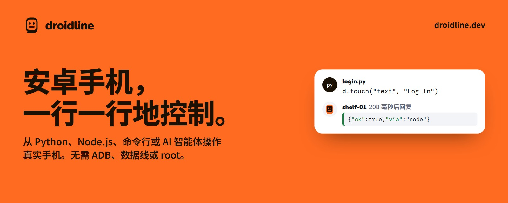
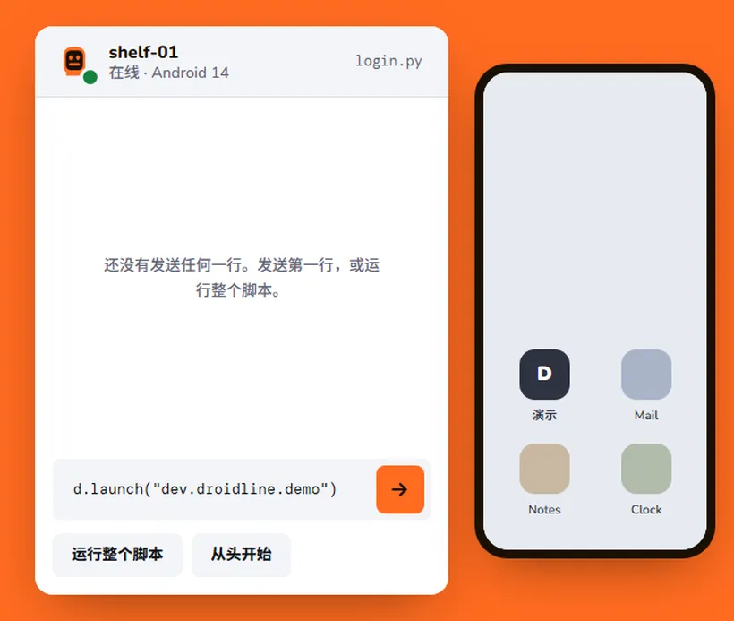
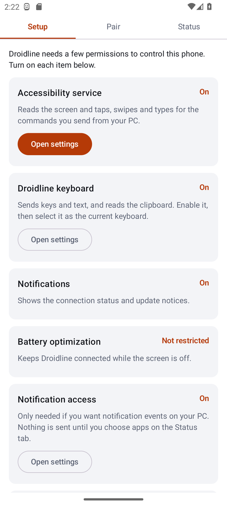
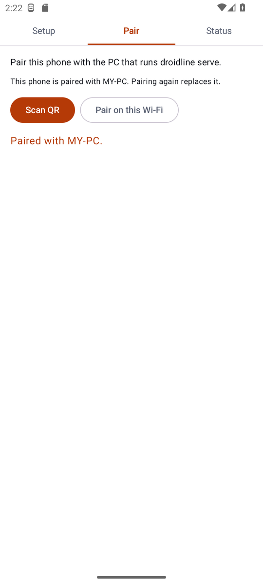
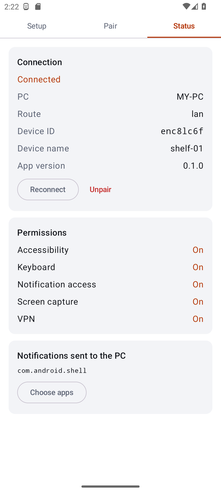

<p align="center">
  <a href="https://droidline.dev/zh/"></a>
</p>

<p align="center">
  <b>用代码自动操作真实的安卓手机。</b><br>
  测试应用、执行重复任务、管理一整排手机，或交给 AI 智能体使用。<br>
  Python、Node.js、命令行或 HTTP 都可以。无需 ADB、USB 数据线或 root。
</p>

<p align="center">
  <a href="https://droidline.dev/zh/"><b>网站</b></a> ·
  <a href="https://droidline.dev/zh/docs/"><b>文档</b></a> ·
  <a href="https://github.com/KnifeLemon/Droidline/releases/latest"><b>下载</b></a> ·
  <a href="#快速开始">快速开始</a> ·
  <a href="#在你的语言中使用">各语言用法</a> ·
  <a href="#文档">指南</a>
</p>

<p align="center">
  <a href="https://github.com/KnifeLemon/Droidline/actions/workflows/ci.yml"></a>
  <a href="https://github.com/KnifeLemon/Droidline/releases/latest"></a>
  
  
  <a href="LICENSE"></a>
</p>

<p align="center"><a href="README.md">English</a> · <a href="README.ko.md">한국어</a> · <b>简体中文</b></p>

<table>
  <tr>
    <td width="33%" valign="top"><b>无需 ADB，无需数据线</b><br>在手机上装一个应用，开启权限，用二维码配对即可。不需要开发者选项、USB 调试或 root。</td>
    <td width="33%" valign="top"><b>处处是同一条命令</b><br><code>touch</code> 在 Python、Node.js、CLI、HTTP 和 MCP 工具中都叫 <code>touch</code>，全部由同一份规范生成。</td>
    <td width="33%" valign="top"><b>手机在哪里都能用</b><br>手机主动连接你的电脑，所以在同一 Wi-Fi 下能用，通过隧道或你自己运行的中继，在移动数据下也能用。每一行都端到端加密。</td>
  </tr>
</table>

## 人们用它做什么

* 在真机上**测试你自己的应用**，包括会跳转到其他应用的流程，例如用短信中的验证码登录。
* 让**一整架手机**每天执行同样的例行任务，每部手机使用各自的网络或代理。
* **给 AI 智能体一双手**：通过 MCP，Claude、ChatGPT、Cursor 等智能体可以查看手机屏幕并进行操作。
* **个人的小型自动化**，例如晚上关闭 Wi-Fi，或者每小时从某个应用中读取一个数值。

Droidline 只使用普通应用能获得的权限，所以有些事情做不到，详见[做不到的事](#做不到的事)。

## 实际效果

<p align="center">
  <a href="https://droidline.dev/zh/"></a><br>
  <sub>在 <a href="https://droidline.dev/zh/">droidline.dev</a> 上可以直接在浏览器中运行同一个演示，并在模拟界面上选择元素</sub>
</p>

## 快速开始

你需要一台电脑（Windows、macOS 或 Linux）和一部 Android 9 及以上的安卓手机。第一次试用时，请让两者连接同一个 Wi-Fi。[安装指南](https://droidline.dev/zh/docs/install/)会配合截图逐步说明。

1. **在电脑上运行服务器。** 从 [Releases](https://github.com/KnifeLemon/Droidline/releases/latest) 下载适合你系统的 `droidline` 压缩包，把 `droidline` 放到 `PATH` 中，然后启动它，并保持运行。

   ```bash
   droidline serve
   ```

2. **在手机上安装应用。** 从同一个发布页面下载 `droidline-agent.apk` 并打开。在应用的 **设置** 标签页中开启无障碍服务、Droidline 键盘、通知，并把电池优化设为不受限制。Android 13 及以上需要先为该应用 **允许受限制的设置**，应用会告诉你位置。

3. **配对。** 在电脑上运行下面的命令，然后在应用的 **配对** 标签页中扫描二维码：

   ```bash
   droidline pair
   ```

   没有摄像头？在应用中点 **在此 Wi-Fi 下配对**，再输入应用显示的 6 位代码：`droidline pair 482913`。

4. **发送命令。**

   ```bash
   droidline launch com.android.settings
   droidline touch text "网络和互联网"
   ```

手边没有手机也没关系。每个版本都附带 `droidline-fakephone`，它能模拟一部装有小型演示应用的手机。[第一个脚本教程](https://droidline.dev/zh/docs/tutorial/) 会用它从头到尾写出一个登录脚本。

## 在你的语言中使用

所有接口都与 `localhost:8780` 上的 `droidline serve` 通信，命令名称也完全相同。

**Python**（`pip install droidline`，Python 3.9 及以上）

```python
from droidline import connect

d = connect()                                  # 与这台电脑配对的手机
d.launch("dev.droidline.demo")
if d.exists("text", "Close ad"):               # 条件判断既不等待也不会失败
    d.touch("text", "Close ad")
d.input("id", "email", "knife")                # 最多等待元素出现 10 秒
d.touch("text", "Log in")
print(d.get_text("id", "greeting"))
```

**Node.js 与 TypeScript**（`npm install droidline`，Node.js 18 及以上）

```js
import { connect } from "droidline";

const d = await connect();
await d.launch("dev.droidline.demo");
await d.input("id", "email", "knife");
await d.touch("text", "Log in", { timeout: 15 });
console.log(await d.getText("id", "greeting"));
```

**C# 与 .NET**（`dotnet add package Droidline`，.NET 8 及以上或 .NET Framework 4.6.2 及以上）

```csharp
using Droidline;

await using var d = await DroidlineClient.ConnectAsync();
await d.LaunchAsync("dev.droidline.demo");
await d.InputAsync("id", "email", "knife");
await d.TouchAsync("text", "Log in", timeout: 15);
Console.WriteLine(await d.GetTextAsync("id", "greeting"));
```

**命令行**（随服务器附带）

```bash
droidline touch text "Log in"
droidline which text="Log in" id=main_tab --timeout 15
droidline screenshot shot.png
```

**HTTP**（任何语言、任何工具）

```bash
curl -s -X POST localhost:8780/devices/_/touch \
  -H 'content-type: application/json' -d '{"by":"text","value":"Log in"}'
```

**通过 MCP 供 AI 智能体使用**（Claude、Cursor、VS Code 等）

```json
{ "mcpServers": { "droidline": { "command": "droidline", "args": ["mcp"] } } }
```

在 Claude Code 中：`claude mcp add droidline -- droidline mcp`。在 Claude Desktop 中也可以直接打开 [Releases](https://github.com/KnifeLemon/Droidline/releases/latest) 里的 `droidline.mcpb`，其中自带 `droidline`；它也以 `io.github.KnifeLemon/droidline` 收录在 [MCP Registry](https://registry.modelcontextprotocol.io)。只想给智能体部分工具时，在 args 里加上 `--tools dump,screenshot,touch` 或 `--read-only`，详见 [限制智能体能用的工具](https://droidline.dev/zh/docs/ai-agents/)。其他语言可以打开 TCP 套接字，每条命令发送一行 JSON。Go、Java 和 PHP 示例见 [其他语言](https://droidline.dev/zh/docs/other-languages/)。

## 功能

- **按元素操作，而不是按像素。** `dump()` 以树的形式返回界面，每个元素都有 `text`、`id` 和 `desc`。命令接收字段和值：`touch("id", "login")`。元素拒绝点击时，Droidline 会自动点击它的父元素或 bounds 的中心。
- **内置等待。** `touch`、`input` 和 `wait` 会等待元素出现，默认 10 秒。`exists`、`checked`、`which` 等条件判断立即作答，元素不存在时也不会抛出异常。
- **清楚的错误。** 每个失败都有错误码、中文、英文或韩文的消息，以及是否值得重试的标记：`NOT_FOUND: 在 10 秒内未找到 text 'Log in'。当前界面：com.example / .MainActivity`。
- **一整架手机。** 一台电脑控制多部手机。发给同一部手机的命令按顺序执行，不同手机之间并行执行，每部手机都可以起你想要的名字。
- **按应用代理。** 通过本地 VPN 让指定应用走 socks5 或 http 上游，每部手机一个上游，无需 root。
- **在电脑上接收通知。** 等待一条、响应每一条、回复、打开或清除，或者转发到带签名的 Webhook。
- **新的移动 IP。** 带 `cuts_network` 的 `batch` 在手机离线时也会继续在手机上运行，所以开启飞行模式、等待、关闭可以在一次调用中完成。设置页面先用 `intent` 打开，具体步骤见[常用示例](https://droidline.dev/zh/docs/recipes/#设置应用强行停止清除数据切换网络)。
- **不会执行两次。** 移动数据断开后重连的手机会从中断处继续；执行中的命令由手机缓存的回复作答，不会再执行一次。
- **经得住变化的选择器。** 可以组合条件，或借助旁边的元素指定：`touch({"class": "android.widget.Switch", "row": {"text": "WLAN"}})`。`find` 返回可以点击、可以在其中继续查找的元素，`wait_idle` 会等到界面不再变化。
- **启动之前都不运行的可选工具。** `droidline inspect` 显示界面和元素，给出带代码的选择器建议，并在你使用手机时录制脚本。`droidline webdriver` 让 Appium 客户端和脚本控制你的手机。另外还有 pytest 插件、在脚本之间共享手机的 lease，以及面向没有元素的界面的图片和文字查找。
- **简体中文、English、한국어**：应用、错误消息和文档都支持。

## 截图

<table>
  <tr>
    <td width="33%"></td>
    <td width="33%"></td>
    <td width="33%"></td>
  </tr>
  <tr>
    <td align="center"><sub>设置：每项权限都有直达设置界面的按钮</sub></td>
    <td align="center"><sub>配对：扫描二维码或使用 6 位代码</sub></td>
    <td align="center"><sub>状态：连接、线路和权限</sub></td>
  </tr>
</table>

<sub>截图拍摄于设置为英文的手机。应用会跟随手机语言显示简体中文。</sub>

## 手机在哪里都能连接

手机总是主动发起连接，所以手机上不需要开放端口。选择适合你网络的线路；手机会按顺序尝试，并在可能时切回 Wi-Fi。

| 线路 | 你需要 | 工作方式 |
|---|---|---|
| 同一 Wi-Fi | 无需设置 | 手机通过 UDP 广播找到电脑并直接连接。 |
| 端口转发 | 转发一个端口 | 手机通过 TLS 连接你的公网地址，并用电脑的证书核对身份。 |
| 隧道 | cloudflared、ngrok 等 | 电脑保持隧道开启，手机通过隧道地址接入。 |
| 自建中继 | Cloudflare Workers 或 VPS | 电脑和手机都向你部署的中继连接，中继只转发它读不懂的数据行。 |

两行握手之后，每一行都用只有你的电脑和手机持有的密钥（P-256 与 AES-256-GCM）加密，所以隧道或中继只能转发密文。[远程连接指南](https://droidline.dev/zh/docs/remote/) 逐一说明每种线路。

## 做不到的事

Droidline 只使用普通应用能获得的权限，因此有些事做不到，最好在开始前了解：

- 无法打开其他应用未导出的界面。`launch` 会改为打开启动界面。
- 无法解锁 PIN、图案或密码锁屏。
- 没有一条命令就能强行停止应用、清除数据或切换网络。设置应用因手机厂商、Android 版本和语言而异，所以由[常用示例](https://droidline.dev/zh/docs/recipes/#设置应用强行停止清除数据切换网络)点击其中的按钮，你可能需要按自己的手机调整按钮文字。在可选的设备所有者模式下，`clear_data` 会直接清除应用数据。
- 游戏和部分自绘界面的应用不提供元素。这类界面请用 `tap` 坐标和 `color(x, y)`。
- Android 15 及以上会对应用隐藏通知中的验证码。你能知道验证码已到达，号码需要在应用界面中读取。

[完整列表](https://droidline.dev/zh/docs/limitations/) 逐项说明。

## 文档

| 我想要…… | 从这里开始 |
|---|---|
| 一步步完成安装 | [安装](https://droidline.dev/zh/docs/install/) |
| 不用手机写出第一个脚本 | [你的第一个脚本](https://droidline.dev/zh/docs/tutorial/) |
| 用我的语言 | [Python](https://droidline.dev/zh/docs/python/) · [Node.js](https://droidline.dev/zh/docs/nodejs/) · [CLI](https://droidline.dev/zh/docs/cli/) · [HTTP](https://droidline.dev/zh/docs/http/) · [AI 智能体](https://droidline.dev/zh/docs/ai-agents/) |
| 在界面上找到合适的元素 | [查找元素](https://droidline.dev/zh/docs/finding-elements/) |
| 点选元素，或录制脚本 | [界面检查与录制](https://droidline.dev/zh/docs/inspector/) |
| 运行 Appium 脚本 | [Appium 与 WebDriver](https://droidline.dev/zh/docs/appium/) |
| 用 pytest 或 Node.js 测试 | [测试框架](https://droidline.dev/zh/docs/testing/) |
| 直接套用可用的做法 | [常用示例](https://droidline.dev/zh/docs/recipes/) |
| 查一条命令 | [命令参考](https://droidline.dev/zh/docs/commands/) |
| 连接使用移动数据的手机 | [远程连接](https://droidline.dev/zh/docs/remote/) |
| 解决遇到的问题 | [故障排查](https://droidline.dev/zh/docs/troubleshooting/) |
| 了解通信格式 | [`spec/PROTOCOL.md`](spec/PROTOCOL.md) |

## 从源码构建

需要：Go 1.26 及以上、Node.js 22、Python 3.9 及以上。构建应用还需要 JDK 17 及以上和 Android SDK（Android Studio 自带的 JDK 即可）。

```bash
git clone https://github.com/KnifeLemon/Droidline.git
cd Droidline
go build ./server/cmd/...              # droidline、droidline-relay、droidline-fakephone
go test ./spec/ ./server/...
node scripts/gen.mjs --check           # 检查 SDK 方法与 spec/commands.json 一致
cd sdk/python && python -m pytest
cd sdk/node && npm ci && npm test
dotnet test sdk/dotnet
cd agent && ./gradlew assembleDebug testDebugUnitTest
```

`scripts/integration.sh` 会同时运行服务器、模拟手机和两个 SDK 演示，CI 做的就是这件事。

| 路径 | 内容 |
|---|---|
| [`spec/`](spec) | `commands.json`（全部命令，三种语言）、`PROTOCOL.md`、加密测试向量 |
| [`server/`](server) | Go：`droidline`（服务器、CLI、MCP）、`droidline-relay`、`droidline-fakephone` |
| [`agent/`](agent) | 安卓应用（Kotlin） |
| [`sdk/python`](sdk/python)、[`sdk/node`](sdk/node)、[`sdk/dotnet`](sdk/dotnet) | 官方 SDK，由规范生成的方法加一层轻量客户端 |
| [`relay/worker`](relay/worker) | 用于 Cloudflare Workers 的中继 |
| [`examples/`](examples) | 在模拟手机上运行的演示脚本 |

## 参与贡献

欢迎提交 Pull Request。规范、生成器和测试如何配合，见 [CONTRIBUTING.md](CONTRIBUTING.md)。目前最有帮助的贡献是真机报告：品牌和 Android 版本，以及用于强行停止、清除数据和网络开关的[设置应用示例](https://droidline.dev/zh/docs/recipes/#设置应用强行停止清除数据切换网络)能否配合该手机的按钮文字使用。如果 Droidline 帮你省下了一些点击，点一个 ⭐ 能让更多人找到它。

## 状态

版本 0.1。服务器、CLI、MCP 适配器、中继和两个 SDK 都在模拟手机上通过了测试，应用通过了单元测试，并能在 Android 13 模拟器上运行。下一步是在不同品牌的真机上验证。具体验证了什么、如何验证，见 [`docs/STATUS.md`](docs/STATUS.md)。

## 安全与隐私

谁可以控制手机由配对决定，握手之后的一切都端到端加密。安全问题请按 [SECURITY.md](SECURITY.md) 中的说明私下报告。

Droidline 不收集使用数据，也不发送遥测。服务器只在你自己的电脑上接受连接；应用只与已配对的电脑通信，并每天一次向 GitHub 检查新版本。请只在你拥有或有权自动化的手机和账号上使用 Droidline，用途见 [使用条款](https://droidline.dev/zh/terms/)。

## 许可证

MIT。见 [LICENSE](LICENSE)。

<p align="center">
  <a href="https://star-history.com/#KnifeLemon/Droidline&Date"></a>
</p>
